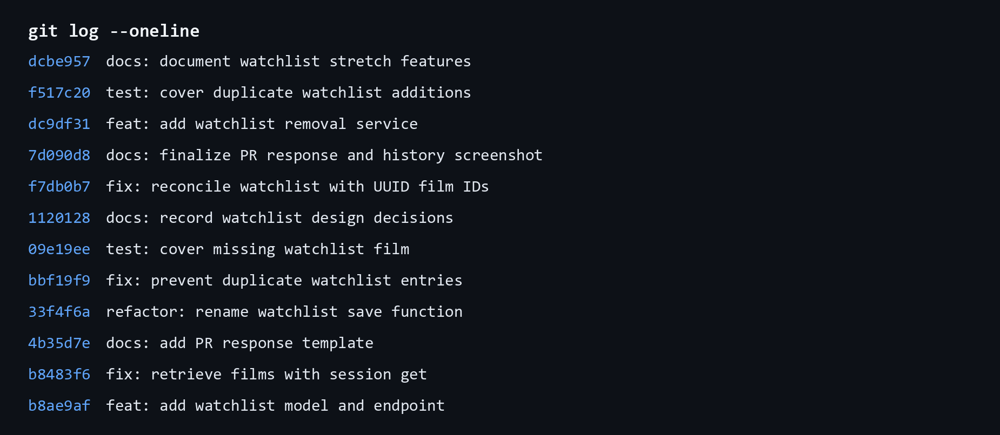

# PR Response Doc — CineLog Watchlist Feature

## AI Usage

I used Codex to orient myself in the existing collection service and its tests, to locate the watchlist call site, and to inspect the review discussion. I also used it to stress-test my visibility and sorting drafts by asking what privacy and usability objections a reviewer could raise. That surfaced the missing caller-facing visibility control and the value of seeing recently saved films. I added the privacy limitation to Comment 4's tradeoff and explained in Comment 5 why recency should be an optional future view rather than this endpoint's default. For Milestone 4, I gave Codex the final `git log --oneline` output to check that each commit used a conventional prefix and represented one logical change; I verified that assessment against `CONTRIBUTING.md` before capturing the history screenshot.

## Comment 1 — Rename

**What I did:** Renamed `save_to_watchlist()` to `add_to_watchlist()` in `services/watchlist_service.py`. I searched the repository for the old name and updated the one call site in `routes/watchlist/watchlist.py`, including its import.

**How I verified:** A follow-up project-wide search returned no `save_to_watchlist` references. I then ran `pytest tests/ -v`; all four existing tests passed.

## Comment 2 — Deduplication

**What I did:** Added `AlreadyInWatchlistError` and a `WatchlistEntry.query.filter_by(user_id=user_id, film_id=film_id).first()` check in `add_to_watchlist()`. The check runs after confirming the film exists and before constructing or committing a new entry, matching `add_to_collection()`'s deduplication flow.

**How I verified:** In an isolated in-memory database, I added the same film twice for one user. The second call raised `AlreadyInWatchlistError`, and the database still contained exactly one matching entry. I also ran `pytest tests/ -v`; all four existing tests passed.

## Comment 3 — Missing test

**What I did:** Created `tests/test_watchlist.py` with `test_add_to_watchlist_nonexistent_film_raises`. I modeled its isolated in-memory database fixture, sample-user fixture, fake ID, and `pytest.raises(FilmNotFoundError)` assertion on `test_add_to_collection_nonexistent_film_raises`.

**How I verified:** `pytest tests/test_watchlist.py -v` passed the new test. I then ran `pytest tests/ -v`; all five tests passed.

## Comment 4 — Default visibility

**My position:** Keep `public=True` as the default for new `WatchlistEntry` records.

**Reasoning:** CineLog is a community film-tracking app, so a watchlist is useful not only as a private reminder but also as a lightweight way to share future viewing interests and discover recommendations. The `public` flag is attached to each entry; defaulting it to public keeps a user's ordinary shared watchlist complete instead of quietly omitting newly saved films. This is an intentional choice to optimize the social, community-facing use of a list that users create to track films they want to see.

**Tradeoff acknowledged:** A watchlist can reveal personal tastes or plans, so a private-by-default policy would better protect users who save films only for themselves. The current add endpoint also does not let a caller set visibility explicitly, which makes the public default more consequential. A follow-up should expose that choice to callers (and revisit the default if CineLog introduces more sensitive list use cases); for this feature, I am documenting the public behavior clearly rather than treating it as an accidental inherited default.

## Comment 5 — Sort order

**My position:** Keep the current alphabetical default in `get_watchlist()` rather than changing the endpoint to date-added order.

**Reasoning:** A CineLog watchlist is a reference list users return to when choosing a film, not a chronological record of viewing activity. Alphabetical order makes a growing list predictable to scan and lets someone quickly find a title they remember. `date_added` says when CineLog captured an item, not when a user intends to watch it; users may add a batch of recommendations at once, so recency does not reliably represent priority. The response already includes `date_added`, so a future client can offer a recent-items view without making the base service order unstable.

**Engagement with reviewer's point:** I agree that recent additions are valuable when a user has just saved a few films or wants to revisit a new recommendation. That is a strong fit for an activity feed or an explicit `sort=recent` option. I disagree that it should replace the default for this endpoint: unlike the collection endpoint, which records completed activity and appropriately uses newest-first, a watchlist is used to browse pending choices. Keeping alphabetical order preserves that browsing use case while leaving room for a later opt-in recency sort.

## Comment 6 — Rebase

**What conflicted:** `git rebase origin/main` first stopped on an add/add conflict in `.gitignore`, because both branches had added the file. The UUID migration itself applied without a textual conflict, but `main` no longer contained the branch's pre-existing `WatchlistEntry` model. That left `watchlist_service.py` unable to import the model after the rebase, and its remaining service and route documentation still described integer film IDs.

**How I resolved it:** I kept the required ignore rules from both versions, including `main`'s `.pytest_cache/` entry, then continued the rebase. I restored `WatchlistEntry` in the UUID model state with `String(36)` `film_id` and its film/user relationships, and updated the watchlist service and POST endpoint documentation to use UUID strings.

**How I verified no conflict remains:** The rebase completed successfully. In an isolated database, I created UUID-backed films, added them to a watchlist, and retrieved them successfully. `pytest tests/ -v` passed all five tests, and the final history check confirms the feature commits sit linearly on `origin/main` with no merge commit.

## Stretch Features

### Remove a watchlist entry

**What I did:** Added `remove_from_watchlist(user_id, film_id)` and `NotInWatchlistError` to `services/watchlist_service.py`. The function uses the same `(user_id, film_id)` lookup and delete/commit flow as `remove_from_collection()`, returning `True` only after it removes an existing entry.

**How I verified:** `test_remove_from_watchlist_removes_entry` saves a real UUID-backed film, removes it, and confirms that no matching `WatchlistEntry` remains in the database.

### Additional edge-case test

**What I did:** Added `test_add_to_watchlist_duplicate_raises`. Although the review required the deduplication behavior, this independently tests the error path and confirms that attempting a second save does not create a second row.

**Why I chose it:** Duplicate entries are especially confusing in a watchlist because they make a user's future choices look larger than they are. Verifying both the raised `AlreadyInWatchlistError` and the one-entry count protects the behavior at the service boundary.

## Commit History Screenshot

## PR Description

### Feature overview

CineLog now supports per-user watchlists. Clients can add a UUID-backed film through `POST /watchlist/<user_id>/add` and retrieve that user's saved films through `GET /watchlist/<user_id>`. The service validates film IDs, rejects duplicate `(user_id, film_id)` entries instead of silently creating a second entry, and provides `remove_from_watchlist()` for service-layer removal.

### Design decisions

- **Visibility:** New watchlist entries default to `public=True` to support CineLog's community sharing and discovery use case. This deliberately trades off privacy, so a future caller-facing visibility option should let users opt out explicitly.
- **Sort order:** The default remains alphabetical by title. A watchlist is a stable reference list for choosing a film, whereas date added reflects capture time rather than viewing priority; a future opt-in recent-items sort can support the maintainer's recency use case.

### Manual testing

1. Run `python app.py`.
2. In a separate terminal, create a local `User` and `Film` in an application context, then record their generated UUIDs. The service's in-memory test fixtures in `tests/test_watchlist.py` show the same model setup.
3. Add the film with `curl -X POST http://127.0.0.1:5000/watchlist/<user_id>/add -H "Content-Type: application/json" -d '{"film_id":"<film_id>"}'`. Confirm a `201` response containing UUID `user_id` and `film_id` values.
4. Request `GET http://127.0.0.1:5000/watchlist/<user_id>` and confirm the saved film appears with `date_added` and `public` metadata.
5. Run `python -m pytest tests/ -v` to verify the service tests, including the nonexistent-film case.
